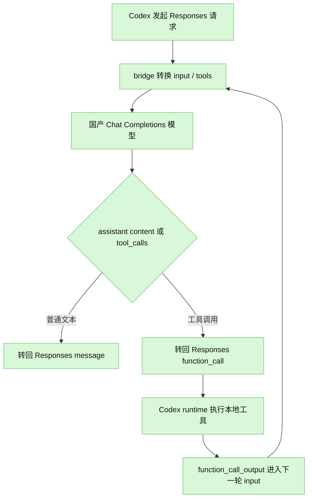

# Codex Bridge — 国产模型 Responses 兼容层

这是一个本地 bridge 层，用来把 Codex Desktop 发出的 OpenAI Responses API 请求，转换到国产大模型常见的 OpenAI-compatible Chat Completions 接口。

它的目标是让 Codex Desktop 的使用体验尽量接近官方接入：能流式输出、能发起 function tool call、能把工具结果带回下一轮、能留下 Codex 可读的 session 日志。但它不是官方 Codex 服务本身，也不会把国产模型变成 GPT 模型；模型能力、工具调用稳定性、推理字段支持情况仍取决于上游服务商。

一句话：**Bridge 负责把 Codex 说的 Responses API，翻译成国产模型能听懂的 Chat Completions API。**

除了协议转换，它还会做一层体验兼容：

- 把 Responses 的 `instructions`、`input`、`tools`、`tool_choice` 转成上游更容易接受的 Chat Completions 请求。
- 有工具可用时自动注入 Codex 工作行为约束，让模型更倾向于调用工具，而不是自然语言假装执行。
- 检测到 `apply_patch` 工具时追加文件编辑专用约束，引导模型用 patch 工具完成修改。
- 把 `max_output_tokens` 映射成常见的 `max_tokens`，减少国产兼容接口的参数不识别问题。
- 在非推理模式下隐藏模型泄漏的 `<think>...</think>` 内容，让输出更像 ChatGPT 成品回答。
- 给缺失 ID 的工具调用补 `call_id`，保证 Codex 后续能把工具结果接回去。
- 对部分模型输出的纯文本 JSON 工具调用做修复，尽量转换回 Responses `function_call`。
- 对模型误输出到普通文本里的 fenced patch / `*** Begin Patch` 内容做修复，尽量转成 `apply_patch` 调用。
- 返回 `output_text`、`error`、`incomplete_details` 等更接近 Responses API 的字段。
- 支持 `GET /v1/responses/{id}` 和 `DELETE /v1/responses/{id}`，方便客户端按官方习惯查询或清理 response。



## 和官方一样吗

不完全一样。官方链路是：

```text
Codex Desktop -> OpenAI Responses API -> GPT 模型
```

Bridge 链路是：

```text
Codex Desktop -> 本地 Responses 兼容入口 -> Bridge -> Chat Completions API -> GLM / 通义千问 / 其他兼容模型
```

| 能力 | 官方 Codex | 本项目 Bridge |
| --- | --- | --- |
| Codex 入口 | Responses API | `/v1/responses` 兼容入口 |
| 上游模型 | OpenAI GPT 系列 | 国产或自建 Chat Completions 模型 |
| 流式输出 | 原生支持 | SSE 事件转换后支持 |
| function tool 调用 | 原生支持 | `tools[].function` 双向转换 |
| Response 查询 | 原生支持 | 内存缓存最近 response |
| 原生工具 | 官方调度 | 默认跳过，可模拟为 function tool |
| 推理字段 | 官方模型原生支持 | 可选转发，取决于上游兼容性 |
| Session 日志 | 官方写入 | 写入 Codex 风格 JSONL，供本地读取 |
| 模型能力 | 官方保证 | 由上游模型决定 |

所以它更准确的定位是：**Codex Desktop 的国产模型桥接层**，不是官方后端的完整替代品。

## 核心转换目标

核心目标不是完整复刻 Responses API 的全部能力，而是优先保障 Codex 最关键的 `function tool` 调用闭环稳定可靠：

1. Codex 侧携带完整 `input[]`，不依赖 `previous_response_id` 或 `conversation`。
2. Responses `instructions` 映射为 Chat Completions `system` 消息。
3. Responses `function` tool 映射为 Chat Completions `tools[].function`。
4. Chat Completions 返回的 `tool_calls` 映射为 Responses `function_call`。
5. Codex runtime 执行本地工具后，把 `function_call_output` 放回下一轮完整上下文。
6. `previous_response_id` 用于关联本地 session 日志，不强行替 Codex 拼接隐藏历史。

## 安装与运行

当前项目零依赖，需要 Node.js 18 或更新版本。

```bash
npm test
```

启动 bridge：

```bash
UPSTREAM_BASE_URL=https://你的国产模型服务商地址/v1 \
UPSTREAM_API_KEY=你的密钥 \
node src/server.js --port 8787
```

如果服务商是类似阿里云 DashScope 的兼容路径，也可以这样：

```bash
UPSTREAM_BASE_URL=https://dashscope.aliyuncs.com/compatible-mode/v1 \
UPSTREAM_API_KEY=你的密钥 \
UPSTREAM_MODEL=你的模型名 \
npm start
```

百度千帆 OpenAI 协议兼容地址：

```bash
UPSTREAM_BASE_URL=https://qianfan.baidubce.com/v2/coding \
UPSTREAM_API_KEY=你的千帆专属APIKey \
UPSTREAM_MODEL=glm-5 \
npm start
```

bridge 会把它转发到：

```text
https://qianfan.baidubce.com/v2/coding/chat/completions
```

然后把 Codex 的 base URL 指向：

```text
http://127.0.0.1:8787/v1
```

Codex 请求 `/v1/responses` 时，bridge 会转发到上游 `/chat/completions`。

## Session 持久化

bridge 会自动将对话写入 `~/.codex/sessions/` 目录，尽量使用 Codex Desktop 可读的 JSONL 结构：

```text
~/.codex/sessions/YYYY/MM/DD/rollout-{timestamp}-{sessionId}.jsonl
```

### JSONL 文件结构

```jsonl
{"type":"session_meta","payload":{"id":"session-uuid","model":"glm-5","model_provider":"bridge",...}}
{"type":"turn_context","payload":{"turn_id":"turn-uuid","model":"glm-5","effort":"medium"}}
{"type":"event_msg","payload":{"type":"task_started","turn_id":"turn-uuid"}}
{"type":"response_item","payload":{"type":"message","role":"user","content":[{"type":"input_text","text":"帮我执行 echo hello"}]}}
{"type":"event_msg","payload":{"type":"agent_message"}}
{"type":"response_item","payload":{"type":"message","role":"assistant","content":[{"type":"output_text","text":"好的，我来帮你执行命令。"}]}}
{"type":"response_item","payload":{"type":"function_call","call_id":"call_001","name":"exec_command","arguments":"{\"cmd\":\"echo hello\"}"}}
{"type":"event_msg","payload":{"type":"token_count","input_tokens":20,"output_tokens":30}}
{"type":"event_msg","payload":{"type":"task_complete","turn_id":"turn-uuid","last_agent_message":"好的，我来帮你执行命令。"}}
```

### 多轮对话关联

通过 `previous_response_id` 关联的请求会追加到同一个 JSONL 文件，不会创建新文件。完整的工具调用闭环（user → assistant → function_call → function_call_output → assistant）会被记录下来。

这样手机端的 CodeIsland 应用可以直接从 `~/.codex/sessions/` 读取 bridge 的对话历史，无需任何额外适配。

## 请求转换规则

### 可稳定转换

- `input[]` 中的 `message` 转成 Chat `messages[]`
- `function_call` 转成 assistant 消息里的 `tool_calls[]`
- `function_call_output` 转成 Chat `role: "tool"` 消息
- Responses `tools[].type === "function"` 转成 Chat `tools[].function`
- `call_id` 映射到 Chat `tool_call_id`，返回时再映射回 `call_id`
- Chat assistant 普通 `content` 转成 Responses `message`
- Responses `max_output_tokens` 转成 Chat `max_tokens`
- Chat assistant 普通文本会额外生成 `output_text`
- Chat `tool_calls[].id` 缺失时会自动补一个稳定的 `call_id`
- 当模型把工具调用写成纯文本 JSON，且工具名存在于本轮 `tools` 中时，可修复为 `function_call`
- 当模型把 patch 放进普通文本，且本轮存在 `apply_patch` 工具时，可修复为 `apply_patch` 的 `function_call`

## 文件编辑适配

Codex Desktop 的 `+1 -2` diff 体验，通常来自真实的文件编辑工具调用，而不是 assistant 普通文本。bridge 会围绕 `apply_patch` 做几件事：

- 有 `apply_patch` 工具时，自动提示模型必须调用该工具，不要只贴代码或 patch。
- 如果模型仍然把 patch 输出成普通文本，bridge 会识别 fenced patch 或 `*** Begin Patch` 片段，并修复成 `apply_patch` function call。
- 如果模型把工具名写成 `patch`、`edit_file`、`file_edit` 等常见别名，bridge 会在本轮存在 `apply_patch` 时归一成 `apply_patch`。
- 如果 patch 里的换行被模型输出成字面量 `\n`，bridge 会归一成真实换行。

这不能让所有国产模型都拥有官方模型同等能力，但能显著提高它们触发 Codex 文件编辑和 diff 展示的概率。

### 需要适配处理

- `previous_response_id` / `conversation`：用于 session 关联。Codex Desktop 通常会发送完整 `input[]`，bridge 不额外拼接隐藏历史，避免重复上下文。
- `tool_choice`：默认推荐 `auto`。强制工具调用会尽量转换，但国产兼容服务的实现可能不一致。
- `developer` 消息：为了兼容 Chat Completions，会降级为 `system`。
- `UPSTREAM_MODEL`：可强制覆盖 Codex 请求里的模型名，适合 Codex 模型名和国产服务商模型名不一致的场景。
- `BRIDGE_REPAIR_TEXT_TOOL_CALLS`：默认开启。用于修复部分模型把工具调用写成文本 JSON 的情况。

### 不可直接原生转接

以下 Responses 原生工具不是通用 function tool，可以通过 `--simulate-native-tools` 选项模拟为 function tool：

- `web_search`
- `image_generation`
- `code_interpreter`
- `computer_use_preview`
- `file_search`

默认跳过并输出 warning。如果你希望发现这类工具时直接失败：

```bash
node src/server.js --strict-native-tools
```

启用原生工具模拟：

```bash
node src/server.js --simulate-native-tools
```

## 多轮对话支持

bridge 支持通过 `previous_response_id` 关联多轮请求：

```bash
# 使用 previous_response_id 进行有状态对话
curl -X POST http://127.0.0.1:8787/v1/responses \
  -d '{
    "model": "glm-5",
    "input": "你好",
    "previous_response_id": "resp_123"
  }'
```

注意：这个 ID 主要用于本地 session 文件关联。真正发给上游模型的上下文来自 Codex 当次请求里的完整 `input[]`。

## Response 查询

bridge 会在内存里缓存最近的 response，支持按官方习惯查询和删除：

```bash
curl http://127.0.0.1:8787/v1/responses/resp_xxx
curl -X DELETE http://127.0.0.1:8787/v1/responses/resp_xxx
```

这个缓存用于改善客户端体验，不是持久数据库；重启 bridge 后会清空。

## 上下文压缩

当对话历史过长时，bridge 会自动压缩上下文：

1. 保留系统消息和最近的消息
2. 截断中间部分，添加压缩提示
3. 默认 token 上限 120K，可通过环境变量调整

## 原生工具模拟

启用 `--simulate-native-tools` 后，原生工具会被转换为 function tool：

| 原生工具 | 模拟的 function tool | 说明 |
| --- | --- | --- |
| `web_search` | `web_search` | 搜索网络信息 |
| `image_generation` | `image_generation` | 生成图片 |
| `code_interpreter` | `code_interpreter` | 执行代码 |
| `file_search` | `file_search` | 搜索文件 |
| `computer_use_preview` | `computer_use_preview` | 模拟计算机操作 |

## 配置增强

支持 `.env` 文件配置：

```bash
# .env 文件示例
UPSTREAM_BASE_URL=https://qianfan.baidubce.com/v2/coding
UPSTREAM_API_KEY=your-api-key
UPSTREAM_MODEL=glm-5
PORT=8787
BRIDGE_HOST=127.0.0.1
BRIDGE_ENABLE_REASONING=1
BRIDGE_SIMULATE_NATIVE_TOOLS=1
BRIDGE_REPAIR_TEXT_TOOL_CALLS=1
BRIDGE_TOOL_CALL_RETRY=1
BRIDGE_MAX_TOOL_CALL_RETRIES=1
BRIDGE_UPSTREAM_MAX_RETRIES=1
BRIDGE_UPSTREAM_RETRY_BASE_DELAY_MS=1000
BRIDGE_UPSTREAM_MAX_RETRY_DELAY_MS=15000
BRIDGE_UPSTREAM_CONCURRENCY=2
BRIDGE_CONVERSATION_MAX_SIZE=1000
BRIDGE_CONVERSATION_TTL_MS=3600000
BRIDGE_TOKEN_ESTIMATION_ENABLED=1
```

## 限流与重试

当链路是 `Codex Desktop -> AI Ma'mi -> Bridge -> 上游模型服务` 时，一次 Codex 任务可能触发多轮工具调用和模型请求。bridge 会做几层保护：

- 上游返回 `429` 或 `5xx` 时自动重试，优先尊重 `Retry-After` 响应头。
- 最终仍是 `429` 时，错误体会标记为 `upstream_rate_limited`，并带回 `retry_after`。
- 通过 `BRIDGE_UPSTREAM_CONCURRENCY` 限制 Bridge 到上游的并发数，减少请求瞬间打爆上游。
- 工具调用修复重试也会走同一套上游退避逻辑，避免坏 tool call 引发请求雪崩。

如果 AI Ma'mi 或上游模型经常报 `429 Too Many Requests`，建议先这样降压：

```bash
BRIDGE_UPSTREAM_CONCURRENCY=1
BRIDGE_UPSTREAM_MAX_RETRIES=1
BRIDGE_UPSTREAM_MAX_RETRY_DELAY_MS=30000
BRIDGE_MAX_TOOL_CALL_RETRIES=1
```

如果仍然频繁限流，可以临时关闭工具调用修复重试，减少额外请求：

```bash
BRIDGE_TOOL_CALL_RETRY=0
```

## 提示词建议

接入后建议在系统提示词中明确约束模型：

- 需要读取文件、搜索、执行命令、运行测试时，必须返回结构化 function tool call。
- 不要用自然语言假装已经执行工具。
- 修改代码或配置后，必须调用工具执行最小范围关联测试。
- 输出最终结论前，需要基于工具结果做校验。

bridge 在检测到本轮有 function tools 时，会自动追加一段类似约束。这样接 AI Mommy 路由或国产模型时，更容易触发 Codex Desktop 原生的工具调用、文件编辑和 diff 展示体验。

## 调试转换

保留了一个离线 CLI，方便只查看 Responses 请求会被转成什么 Chat Completions 请求：

```bash
npm run demo:print
node src/cli.js --print examples/request.json
```

## 作为库使用

```js
import {
  toChatCompletionsRequest,
  fromChatCompletionsResponse
} from "./src/adapter.js";

const { chatRequest, warnings } = toChatCompletionsRequest(responsesLikeRequest);
const responsesLikeResult = fromChatCompletionsResponse(chatCompletionsResult);
```

## 环境变量

| 变量 | 说明 |
| --- | --- |
| `UPSTREAM_BASE_URL` | 国产模型 OpenAI-compatible base URL，例如 `https://.../v1` |
| `UPSTREAM_API_KEY` | 上游国产模型密钥 |
| `UPSTREAM_MODEL` | 可选，覆盖 Codex 请求里的 `model` |
| `BRIDGE_HOST` | 可选，默认 `127.0.0.1` |
| `PORT` | 可选，默认 `8787` |
| `BRIDGE_ENABLE_REASONING` | 可选，`1` 启用推理模式 |
| `BRIDGE_SIMULATE_NATIVE_TOOLS` | 可选，`1` 启用原生工具模拟 |
| `BRIDGE_STRICT_NATIVE_TOOLS` | 可选，`1` 严格模式（原生工具报错） |
| `BRIDGE_REPAIR_TEXT_TOOL_CALLS` | 可选，`1` 修复文本 JSON/patch 为工具调用 |
| `BRIDGE_TOOL_CALL_RETRY` | 可选，`1` 启用畸形工具调用自动修正重试 |
| `BRIDGE_MAX_TOOL_CALL_RETRIES` | 可选，工具调用修正最大重试次数，默认 `1` |
| `BRIDGE_UPSTREAM_MAX_RETRIES` | 可选，上游 `429/5xx` 或网络错误最大重试次数，默认 `1` |
| `BRIDGE_UPSTREAM_RETRY_BASE_DELAY_MS` | 可选，上游重试基础等待时间，默认 `1000` |
| `BRIDGE_UPSTREAM_MAX_RETRY_DELAY_MS` | 可选，上游重试最大等待时间，默认 `15000` |
| `BRIDGE_UPSTREAM_CONCURRENCY` | 可选，Bridge 到上游最大并发数，默认 `2` |
| `BRIDGE_CONVERSATION_MAX_SIZE` | 可选，对话最大数量，默认 `1000` |
| `BRIDGE_CONVERSATION_TTL_MS` | 可选，对话过期时间（毫秒），默认 `3600000` |
| `BRIDGE_TOKEN_ESTIMATION_ENABLED` | 可选，`0` 禁用 token 估算 |
