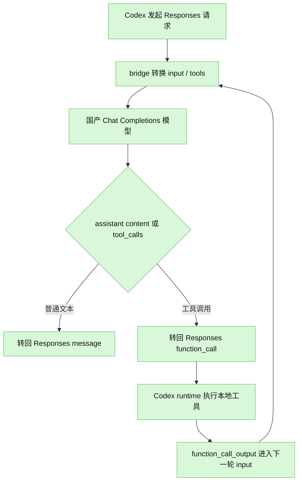

# 国产大模型 Codex Chat Completions Bridge

这是一个本地 bridge 层，用来把 Codex 发出的 Responses 请求转接到国产大模型常见的 OpenAI-compatible Chat Completions 接口。

它不是简单替换 API 地址，而是做协议翻译：



核心目标不是完整复刻 Responses API，而是优先保障 `function tool` 调用闭环稳定可靠：

1. Codex 侧携带完整 `input[]`，不依赖 `previous_response_id` 或 `conversation`。
2. Responses `function` tool 映射为 Chat Completions `tools[].function`。
3. Chat Completions 返回的 `tool_calls` 映射为 Responses `function_call`。
4. Codex runtime 执行本地工具后，把 `function_call_output` 放回下一轮完整上下文。

## 安装与运行

当前项目零依赖，需要 Node.js 18 或更新版本。

```bash
npm test
```

启动 bridge：

```bash
UPSTREAM_BASE_URL=https://你的国产模型服务商地址/v1 \
UPSTREAM_API_KEY=你的密钥 \
node src/server.js --port 8787
```

如果服务商是类似阿里云 DashScope 的兼容路径，也可以这样：

```bash
UPSTREAM_BASE_URL=https://dashscope.aliyuncs.com/compatible-mode/v1 \
UPSTREAM_API_KEY=你的密钥 \
UPSTREAM_MODEL=你的模型名 \
npm start
```

百度千帆 OpenAI 协议兼容地址：

```bash
UPSTREAM_BASE_URL=https://qianfan.baidubce.com/v2/coding \
UPSTREAM_API_KEY=你的千帆专属APIKey \
UPSTREAM_MODEL=glm-5 \
npm start
```

bridge 会把它转发到：

```text
https://qianfan.baidubce.com/v2/coding/chat/completions
```

然后把 Codex 的 base URL 指向：

```text
http://127.0.0.1:8787/v1
```

Codex 请求 `/v1/responses` 时，bridge 会转发到上游 `/chat/completions`。

## 请求转换规则

### 可稳定转换

- `input[]` 中的 `message` 转成 Chat `messages[]`
- `function_call` 转成 assistant 消息里的 `tool_calls[]`
- `function_call_output` 转成 Chat `role: "tool"` 消息
- Responses `tools[].type === "function"` 转成 Chat `tools[].function`
- `call_id` 映射到 Chat `tool_call_id`，返回时再映射回 `call_id`
- Chat assistant 普通 `content` 转成 Responses `message`

### 需要适配处理

- `previous_response_id` / `conversation`：当前工具直接拒绝，因为服务端无法独立复原完整上下文。
- `tool_choice`：默认推荐 `auto`。强制工具调用会尽量转换，但国产兼容服务的实现可能不一致。
- `developer` 消息：为了兼容 Chat Completions，会降级为 `system`。
- `UPSTREAM_MODEL`：可强制覆盖 Codex 请求里的模型名，适合 Codex 模型名和国产服务商模型名不一致的场景。

### 不可直接原生转接

以下 Responses 原生工具不是通用 function tool，默认会跳过并输出 warning：

- `web_search`
- `image_generation`
- `code_interpreter`
- `computer_use_preview`
- `file_search`

如果你希望发现这类工具时直接失败：

```bash
node src/server.js --strict-native-tools
```

## 提示词建议

接入后建议在系统提示词中明确约束模型：

- 需要读取文件、搜索、执行命令、运行测试时，必须返回结构化 function tool call。
- 不要用自然语言假装已经执行工具。
- 修改代码或配置后，必须调用工具执行最小范围关联测试。
- 输出最终结论前，需要基于工具结果做校验。

## 调试转换

保留了一个离线 CLI，方便只查看 Responses 请求会被转成什么 Chat Completions 请求：

```bash
npm run demo:print
node src/cli.js --print examples/request.json
```

## 作为库使用

```js
import {
  toChatCompletionsRequest,
  fromChatCompletionsResponse
} from "./src/adapter.js";

const { chatRequest, warnings } = toChatCompletionsRequest(responsesLikeRequest);
const responsesLikeResult = fromChatCompletionsResponse(chatCompletionsResult);
```

## 环境变量

| 变量 | 说明 |
| --- | --- |
| `UPSTREAM_BASE_URL` | 国产模型 OpenAI-compatible base URL，例如 `https://.../v1` |
| `UPSTREAM_API_KEY` | 上游国产模型密钥 |
| `UPSTREAM_MODEL` | 可选，覆盖 Codex 请求里的 `model` |
| `BRIDGE_HOST` | 可选，默认 `127.0.0.1` |
| `PORT` | 可选，默认 `8787` |
