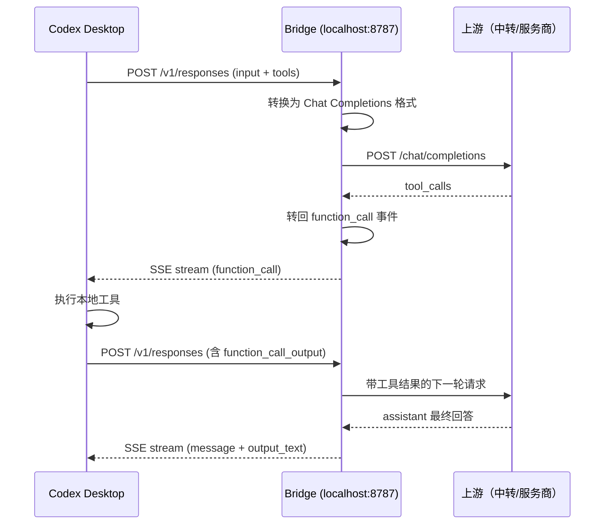

<h1 align="center">🌉 Codex Bridge</h1>

<p align="center">
  <strong>把国产模型的 URL 转成 Codex Desktop 认的 URL</strong>
</p>

<p align="center">
  Codex 用的是 Responses API，国产模型只认 Chat Completions API。<br>
  Bridge 在本地起一个翻译层——你只管填上游 URL，剩下的它来。
</p>

<p align="center">
  =18">
  
  
</p>

---

## 它是什么

Bridge 只做一件事：**协议转换**。

Codex Desktop 发出的是 Responses API 请求，但国内模型（通过 CCWatch、AiMaMi 等中转）只提供 Chat Completions API。Bridge 把两者对接起来：

```
Codex Desktop  →  localhost:8787  →  Bridge 协议转换  →  你的上游 URL  →  模型
```

- **不处理密钥** — Key 由你的中转工具（CCWatch / AiMaMi）注入，Bridge 不碰
- **不选择模型** — 模型由 Codex 客户端或中转工具指定，Bridge 只转发
- **不做代理** — 不是套壳转发，是真正的协议双向翻译：请求翻过去，结果翻回来

## 快速开始

### 1. 安装

```bash
git clone https://github.com/LayLIiu/codex-bridge.git
cd codex-bridge
```

零依赖，只需 Node.js 18+。

### 2. 启动 Bridge

只需要填一个上游 URL：

```bash
# 配合 CCWatch / AiMaMi 等本地中转使用
UPSTREAM_BASE_URL=http://127.0.0.1:你的中转端口/v1 npm start

# 或者直连支持 Chat Completions 的服务商
UPSTREAM_BASE_URL=https://qianfan.baidubce.com/v2/coding npm start
UPSTREAM_BASE_URL=https://dashscope.aliyuncs.com/compatible-mode/v1 npm start
UPSTREAM_BASE_URL=https://api.deepseek.com/v1 npm start
```

Bridge 默认监听 `http://127.0.0.1:8787`。

### 3. 配置 Codex Desktop

在 Codex 设置里把 API Base URL 指向 Bridge：

```
http://127.0.0.1:8787/v1
```

API Key 随便填一个非空字符串（密钥由你的中转工具管理，Bridge 不校验）。

### 4. 开始用

正常打开 Codex Desktop，对话、写代码、调工具——和官方 API 体验基本一致。

## 图形面板

不想敲命令行？用 GUI 面板：

```bash
cd gui
npm install
npx electron .
```

填上游 URL，点启动，完事。

## 能做到什么

| 能力 | 状态 | 说明 |
| --- | --- | --- |
| 流式输出 | ✅ | SSE 事件实时转换 |
| Function Tool 调用 | ✅ | `tools[].function` 双向映射，call_id 自动补齐 |
| 工具调用闭环 | ✅ | Codex 执行本地工具 → `function_call_output` 带回下一轮 |
| 文件编辑 / Diff | ✅ | `apply_patch` 自动约束 + 文本 patch 修复 |
| 过程文字展示 | ✅ | `toolProgressMode=preface` 工具前开场可见，不卡不闪 |
| 畸形工具调用修复 | ✅ | 纯文本 JSON / fenced patch → `function_call` |
| 推理模式 | ✅ | 可选转发 `<tool_call>thinking` 内容 |
| 429 / 5xx 重试 | ✅ | 尊重 `Retry-After`，指数退避 |
| Session 日志 | ✅ | Codex 风格 JSONL，可被手机端读取 |
| 原生工具模拟 | ✅ | `web_search`、`image_generation` 等模拟为 function tool |

## 典型使用场景

**配合 CCWatch / AiMaMi（最常见）：**

```
Codex Desktop → Bridge (8787) → CCWatch/AiMaMi (本地中转) → 模型
```

密钥和模型都由中转工具管理，Bridge 只负责把 Responses API 翻译成 Chat Completions API。

**直连服务商：**

```
Codex Desktop → Bridge (8787) → 千帆/DashScope/DeepSeek → 模型
```

需要通过 `UPSTREAM_API_KEY` 环境变量传入密钥，或由 `.env` 文件提供。

## 工具调用流程



## 过程文字策略

国产模型在工具调用前常常会说"我先看看项目结构"之类的话。Bridge 提供三种处理模式：

| 模式 | 效果 | 适用场景 |
| --- | --- | --- |
| `preface`（默认） | 开场白作为可见消息显示，工具开始后自动关闭 | **推荐**：体验最自然 |
| `reasoning` | 过程文字折入 reasoning 思考气泡 | 偏好简洁对话区 |
| `silent` | 过程文字完全吞掉 | 严格产出导向 |

```bash
BRIDGE_TOOL_PROGRESS_MODE=reasoning npm start
```

## 配置

### 环境变量

| 变量 | 默认值 | 说明 |
| --- | --- | --- |
| `UPSTREAM_BASE_URL` | - | **必填**，上游 URL |
| `UPSTREAM_API_KEY` | - | 可选，直连服务商时填写；配合中转工具时不需要 |
| `UPSTREAM_MODEL` | - | 可选，覆盖模型名；配合中转工具时不需要 |
| `PORT` | `8787` | Bridge 监听端口 |
| `BRIDGE_TOOL_PROGRESS_MODE` | `preface` | 过程文字模式：`preface` / `reasoning` / `silent` |
| `BRIDGE_ENABLE_REASONING` | `0` | 启用推理模式 |
| `BRIDGE_SIMULATE_NATIVE_TOOLS` | `0` | 将原生工具模拟为 function tool |
| `BRIDGE_REPAIR_TEXT_TOOL_CALLS` | `1` | 修复文本 JSON / patch 为工具调用 |
| `BRIDGE_TOOL_CALL_RETRY` | `1` | 畸形工具调用自动修正重试 |
| `BRIDGE_UPSTREAM_MAX_RETRIES` | `1` | 上游 429/5xx 最大重试次数 |
| `BRIDGE_UPSTREAM_CONCURRENCY` | `2` | Bridge 到上游最大并发数 |

### .env 文件

在项目根目录创建 `.env` 文件：

```bash
# 配合中转工具——只需要 URL
UPSTREAM_BASE_URL=http://127.0.0.1:9090/v1

# 直连服务商——加上密钥
UPSTREAM_BASE_URL=https://qianfan.baidubce.com/v2/coding
UPSTREAM_API_KEY=your-api-key
```

### 命令行参数

```bash
node src/server.js --upstream-base-url https://... --port 8787
```

优先级：命令行 > 环境变量 > `.env` 文件 > 默认值。

## 已验证兼容的上游

| 上游 | Base URL 示例 | 备注 |
| --- | --- | --- |
| CCWatch / AiMaMi | `http://127.0.0.1:端口号/v1` | 本地中转，最常见 |
| 百度千帆 | `https://qianfan.baidubce.com/v2/coding` | 路径自动拼接 |
| 阿里云 DashScope | `https://dashscope.aliyuncs.com/compatible-mode/v1` | |
| DeepSeek | `https://api.deepseek.com/v1` | |
| 智谱 GLM | `https://open.bigmodel.cn/api/paas/v4` | |
| 硅基流动 | `https://api.siliconflow.cn/v1` | |
| Ollama 本地 | `http://127.0.0.1:11434/v1` | 本地模型也能接 |
| 任何 OpenAI 兼容 | `https://your-provider.com/v1` | 只要支持 `/chat/completions` |

## API 端点

| 方法 | 路径 | 说明 |
| --- | --- | --- |
| `POST` | `/v1/responses` | Responses API 协议转换（Codex 正常使用） |
| `POST` | `/v1/chat/completions` | Chat Completions 透传（CCWatch/AiMaMi 测速用） |
| `GET` | `/v1/models` | 返回模型列表 |
| `GET` | `/v1/responses/:id` | 查询已创建的 Response |
| `DELETE` | `/v1/responses/:id` | 删除缓存的 Response |
| `GET` | `/health` | 健康检查 |

## Session 日志

Bridge 自动把对话写入 `~/.codex/sessions/`，使用 Codex 风格 JSONL 结构，可被手机端 App 直接读取。

## 文件编辑适配

Codex 的 `+1 -2` diff 体验来自 `apply_patch` 工具调用。Bridge 做了多层修复：

1. **自动约束** — 提示模型必须调用工具，不要只贴代码
2. **文本修复** — fenced patch / `*** Begin Patch` 自动转成 `function_call`
3. **别名归一** — `patch`、`edit_file` 等别名统一映射到 `apply_patch`
4. **换行修复** — 字面量 `\n` 归一为真实换行

## 常见问题

**Q: 我用 CCWatch / AiMaMi，怎么配置？**
A: Bridge 的 `UPSTREAM_BASE_URL` 填服务商 URL（如千帆 `https://qianfan.baidubce.com/v2/coding`），启动后得到 `http://127.0.0.1:8787/v1`。在 CCWatch / AiMaMi 里填入这个地址，配好密钥和模型，测速和正常使用都没问题——Bridge 同时支持 `/v1/responses`（Codex 协议转换）和 `/v1/chat/completions`（中转工具测速透传）。

**Q: 支持 GPT / Claude 吗？**
A: 只要上游暴露 OpenAI 兼容的 `/chat/completions` 就能接。但如果你直接用官方 OpenAI API，Codex 本身就支持，不需要 Bridge。

**Q: Bridge 会存储我的密钥吗？**
A: Bridge 不处理密钥。配合中转工具时，密钥由中转工具管理；直连服务商时，Key 只在进程内存中传递，不会写入日志。

**Q: 可以在服务器上部署吗？**
A: 可以，但 Bridge 设计为本地使用，没有内置鉴权。远程访问建议走 SSH 隧道或 VPN。

## License

MIT
