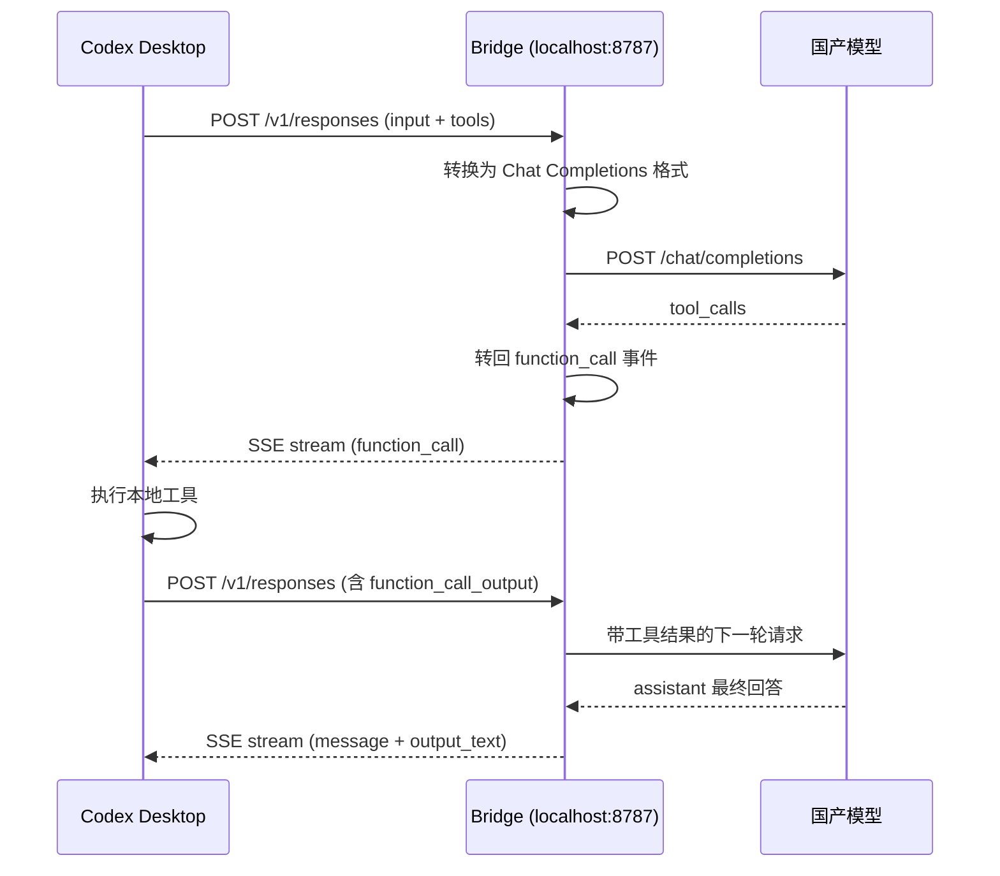

<h1 align="center">🌉 Codex Bridge</h1>

<p align="center">
  <strong>让 Codex Desktop 接入任何 OpenAI 兼容模型</strong>
</p>

<p align="center">
  一行命令，把 Codex 的 Responses API 翻译成国产模型听得懂的 Chat Completions API。<br>
  工具调用、流式输出、文件编辑、Session 日志——全部打通。
</p>

<p align="center">
  =18">
  
  
</p>

---

## 它解决什么问题

Codex Desktop 用的是 OpenAI **Responses API**，但国内主流模型（GLM、通义千问、DeepSeek、百度千帆等）只提供 **Chat Completions API**。协议不兼容，Codex 就接不上。

Codex Bridge 在本地起一个翻译层：

```
Codex Desktop  →  localhost:8787/v1/responses  →  Bridge 翻译  →  上游 Chat Completions  →  国产模型
```

不是代理，不是套壳——它做的是**协议双向转换**：请求翻译过去，结果翻译回来，让 Codex 以为自己在跟官方 API 对话。

## 能做到什么

| 能力 | 状态 | 说明 |
| --- | --- | --- |
| 流式输出 | ✅ | SSE 事件实时转换 |
| Function Tool 调用 | ✅ | `tools[].function` 双向映射，call_id 自动补齐 |
| 工具调用闭环 | ✅ | Codex 执行本地工具 → `function_call_output` 带回下一轮 |
| 文件编辑 / Diff | ✅ | `apply_patch` 自动约束 + 文本 patch 修复 |
| 过程文字展示 | ✅ | `toolProgressMode=preface` 工具前开场可见，不卡不闪 |
| 畸形工具调用修复 | ✅ | 纯文本 JSON / fenced patch → `function_call` |
| 推理模式 | ✅ | 可选转发 `<think>` 内容 |
| 429 / 5xx 重试 | ✅ | 尊重 `Retry-After`，指数退避 |
| Session 日志 | ✅ | Codex 风格 JSONL，可被手机端读取 |
| 原生工具模拟 | ✅ | `web_search`、`image_generation` 等模拟为 function tool |

## 快速开始

### 1. 安装

```bash
git clone https://github.com/你的用户名/codex-bridge.git
cd codex-bridge
```

零依赖，只需 Node.js 18+。

### 2. 启动 Bridge

```bash
# 百度千帆
UPSTREAM_BASE_URL=https://qianfan.baidubce.com/v2/coding \
UPSTREAM_API_KEY=你的密钥 \
npm start

# 阿里云 DashScope
UPSTREAM_BASE_URL=https://dashscope.aliyuncs.com/compatible-mode/v1 \
UPSTREAM_API_KEY=你的密钥 \
UPSTREAM_MODEL=qwen-plus \
npm start

# 任何 OpenAI 兼容服务
UPSTREAM_BASE_URL=https://your-provider.com/v1 \
UPSTREAM_API_KEY=你的密钥 \
npm start
```

Bridge 默认监听 `http://127.0.0.1:8787`。

### 3. 配置 Codex Desktop

在 Codex 设置里把 API Base URL 指向 Bridge：

```
http://127.0.0.1:8787/v1
```

填入你的模型名和 API Key（Key 可以是任意值，Bridge 会用环境变量里的 Key 转发）。

### 4. 开始用

正常打开 Codex Desktop，对话、写代码、调工具——体验和接官方 API 基本一致。

## 工具调用流程



## 过程文字策略

国产模型在工具调用前常常会说"我先看看项目结构"之类的话。Bridge 提供三种处理模式，通过 `BRIDGE_TOOL_PROGRESS_MODE` 配置：

| 模式 | 效果 | 适用场景 |
| --- | --- | --- |
| `preface`（默认） | 开场白作为可见消息显示，工具开始后自动关闭，最终回答单独呈现 | **推荐**：体验最自然 |
| `reasoning` | 过程文字折入 reasoning 思考气泡，不在主消息流显示 | 偏好简洁对话区 |
| `silent` | 过程文字完全吞掉，工具轮只显示工具调用结果 | 严格产出导向 |

```bash
# 使用默认 preface 模式（无需额外配置）
npm start

# 切换为 reasoning 折叠
BRIDGE_TOOL_PROGRESS_MODE=reasoning npm start
```

## 配置

### 环境变量

| 变量 | 默认值 | 说明 |
| --- | --- | --- |
| `UPSTREAM_BASE_URL` | - | **必填**，上游 OpenAI 兼容 Base URL |
| `UPSTREAM_API_KEY` | - | **必填**，上游 API Key |
| `UPSTREAM_MODEL` | - | 可选，覆盖 Codex 请求里的模型名 |
| `PORT` | `8787` | Bridge 监听端口 |
| `BRIDGE_HOST` | `127.0.0.1` | Bridge 监听地址 |
| `BRIDGE_TOOL_PROGRESS_MODE` | `preface` | 工具过程文字模式：`preface` / `reasoning` / `silent` |
| `BRIDGE_ENABLE_REASONING` | `0` | 启用推理模式，转发 `<think>` 内容 |
| `BRIDGE_SIMULATE_NATIVE_TOOLS` | `0` | 将原生工具模拟为 function tool |
| `BRIDGE_STRICT_NATIVE_TOOLS` | `0` | 严格模式，遇到原生工具直接报错 |
| `BRIDGE_REPAIR_TEXT_TOOL_CALLS` | `1` | 修复文本 JSON / patch 为工具调用 |
| `BRIDGE_TOOL_CALL_RETRY` | `1` | 畸形工具调用自动修正重试 |
| `BRIDGE_MAX_TOOL_CALL_RETRIES` | `1` | 工具调用修正最大重试次数 |
| `BRIDGE_UPSTREAM_MAX_RETRIES` | `1` | 上游 429/5xx 最大重试次数 |
| `BRIDGE_UPSTREAM_RETRY_BASE_DELAY_MS` | `1000` | 上游重试基础等待时间 |
| `BRIDGE_UPSTREAM_MAX_RETRY_DELAY_MS` | `15000` | 上游重试最大等待时间 |
| `BRIDGE_UPSTREAM_CONCURRENCY` | `2` | Bridge 到上游最大并发数 |
| `BRIDGE_CONVERSATION_MAX_SIZE` | `1000` | 对话缓存最大数量 |
| `BRIDGE_CONVERSATION_TTL_MS` | `3600000` | 对话缓存过期时间 |
| `BRIDGE_TOKEN_ESTIMATION_ENABLED` | `1` | Token 估算开关 |

### .env 文件

在项目根目录创建 `.env` 文件，不用每次敲环境变量：

```bash
UPSTREAM_BASE_URL=https://qianfan.baidubce.com/v2/coding
UPSTREAM_API_KEY=your-api-key
UPSTREAM_MODEL=glm-5
PORT=8787
BRIDGE_TOOL_PROGRESS_MODE=preface
BRIDGE_UPSTREAM_CONCURRENCY=2
```

### 命令行参数

```bash
node src/server.js \
  --port 8787 \
  --upstream-base-url https://... \
  --upstream-api-key sk-xxx \
  --model glm-5 \
  --tool-progress-mode preface \
  --simulate-native-tools \
  --enable-reasoning
```

优先级：命令行 > 环境变量 > `.env` 文件 > 默认值。

## 文件编辑适配

Codex Desktop 的 `+1 -2` diff 体验来自 `apply_patch` 工具调用。Bridge 围绕它做了多层修复：

1. **自动约束** — 有 `apply_patch` 工具时，提示模型必须调用工具，不要只贴代码
2. **文本修复** — 模型仍输出 fenced patch / `*** Begin Patch` 时，自动转成 `function_call`
3. **别名归一** — `patch`、`edit_file`、`file_edit` 等别名统一映射到 `apply_patch`
4. **换行修复** — 字面量 `\n` 归一为真实换行

## 已验证兼容的模型服务

| 服务商 | Base URL 示例 | 备注 |
| --- | --- | --- |
| 百度千帆 | `https://qianfan.baidubce.com/v2/coding` | 路径自动拼接 `/chat/completions` |
| 阿里云 DashScope | `https://dashscope.aliyuncs.com/compatible-mode/v1` | |
| DeepSeek | `https://api.deepseek.com/v1` | |
| 智谱 GLM | `https://open.bigmodel.cn/api/paas/v4` | |
| 硅基流动 | `https://api.siliconflow.cn/v1` | |
| Ollama 本地 | `http://127.0.0.1:11434/v1` | 本地模型也能接 |
| 任何 OpenAI 兼容 | `https://your-provider.com/v1` | 只要支持 `/chat/completions` |

## 限流与重试

一次 Codex 任务可能触发多轮工具调用。Bridge 会：

- 上游返回 `429` / `5xx` 时自动重试，优先尊重 `Retry-After`
- 最终仍 `429` 时返回 `upstream_rate_limited` 错误体
- 通过 `BRIDGE_UPSTREAM_CONCURRENCY` 限制并发，避免打爆上游

如果经常被限流，先降压：

```bash
BRIDGE_UPSTREAM_CONCURRENCY=1
BRIDGE_UPSTREAM_MAX_RETRIES=1
BRIDGE_UPSTREAM_MAX_RETRY_DELAY_MS=30000
```

## Session 日志

Bridge 自动把对话写入 `~/.codex/sessions/`，使用 Codex 风格 JSONL 结构。多轮工具调用闭环完整记录，可被手机端 App（如 CodeIsland）直接读取。

```
~/.codex/sessions/YYYY/MM/DD/rollout-{timestamp}-{sessionId}.jsonl
```

## API 兼容

Bridge 暴露以下 Responses 风格端点：

| 方法 | 路径 | 说明 |
| --- | --- | --- |
| `POST` | `/v1/responses` | 创建 Response（支持 `stream: true`） |
| `GET` | `/v1/responses/:id` | 查询已创建的 Response |
| `DELETE` | `/v1/responses/:id` | 删除缓存的 Response |

## 打包部署

Bridge 支持打包为单文件部署，适合嵌入桌面应用：

```bash
npm run build
# 产物在 dist/server.js，零依赖可直接运行
node dist/server.js --port 8787
```

## 作为库使用

```js
import {
  toChatCompletionsRequest,
  fromChatCompletionsResponse,
  createStreamConverter
} from "./src/adapter.js";

// 请求转换
const { chatRequest, warnings } = toChatCompletionsRequest(responsesRequest);

// 流式转换
const converter = createStreamConverter("resp_123", "glm-5", {
  deferMessageUntilFinish: true,
  toolProgressMode: "preface"
});
for (const event of converter.processChunk(chatChunk)) {
  // Responses 风格 SSE 事件
}
```

## 测试

```bash
npm test
```

64 个测试覆盖：协议转换、流式事件、工具调用映射、畸形修复、重试逻辑、限流处理、过程文字策略。

## 架构

```
src/
├── server.js          # HTTP 服务 + 流式处理 + 限流重试
├── adapter.js         # 协议双向转换 + 流式事件转换器
├── config.js          # 配置加载（CLI / 环境变量 / .env / 默认值）
├── cli.js             # 离线调试 CLI
├── token-estimator.js # Token 估算
└── tool-simulator.js  # 原生工具模拟

test/
├── adapter.test.js    # 协议转换单元测试
└── server.test.js     # 端到端集成测试
```

## 常见问题

**Q: Bridge 会存储我的 API Key 吗？**
A: 不会。Key 只在启动时从环境变量或 `.env` 读取，存在进程内存里，不会写入日志或外部存储。

**Q: 支持 GPT / Claude 吗？**
A: 支持。只要服务暴露 OpenAI 兼容的 `/chat/completions` 端点，Bridge 就能接。但如果你用的是官方 OpenAI API，直接在 Codex 里填官方 Base URL 就行，不需要 Bridge。

**Q: 为什么工具调用偶尔失败？**
A: 部分国产模型对 function calling 的稳定性不如 GPT。Bridge 会做畸形修复和重试，但模型本身的工具调用能力仍是决定性因素。建议在系统提示词里明确约束模型必须返回结构化工具调用。

**Q: 可以在服务器上部署吗？**
A: 可以，但不推荐暴露到公网。Bridge 设计为本地使用，没有内置鉴权。如果需要远程访问，建议通过 SSH 隧道或 VPN。

## License

MIT
